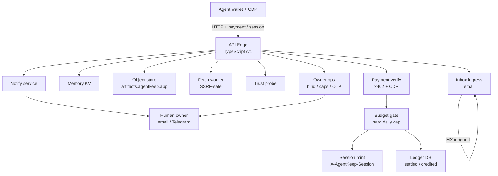
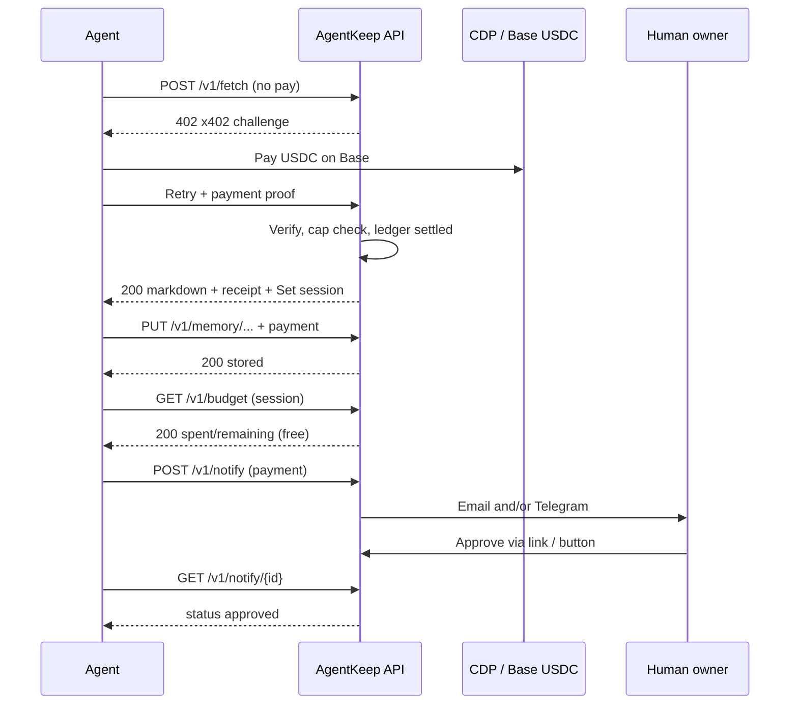
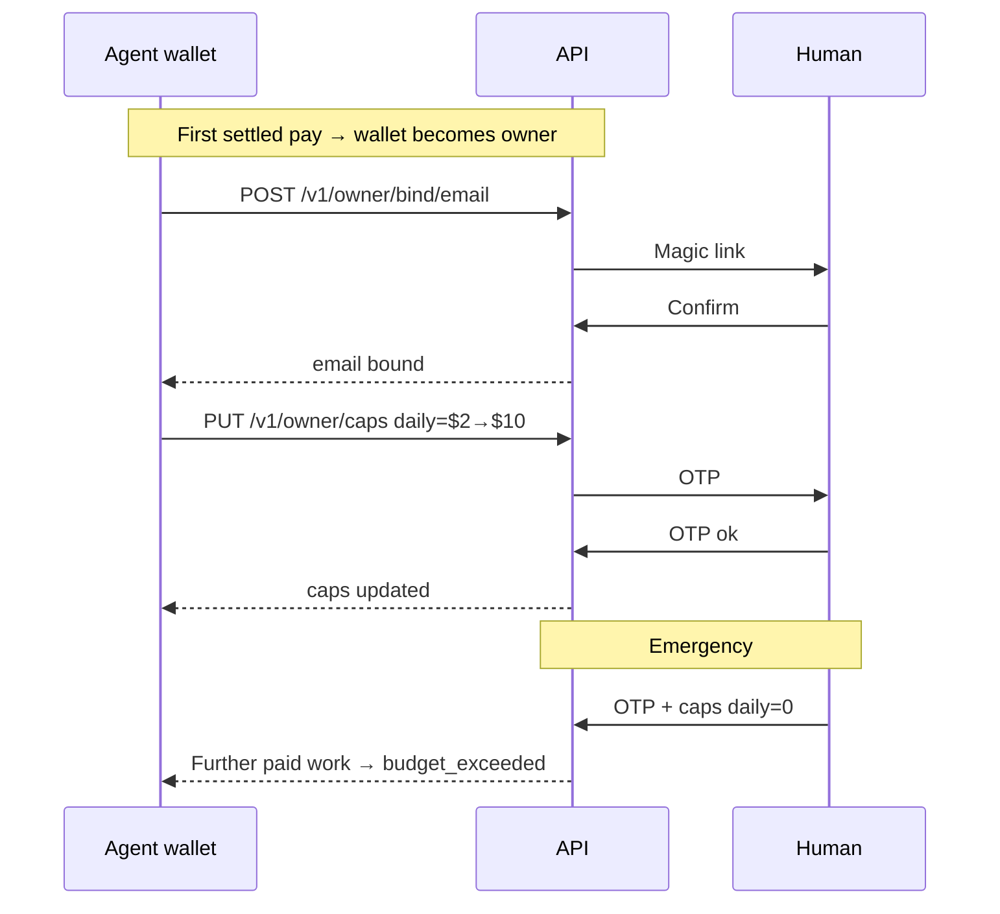
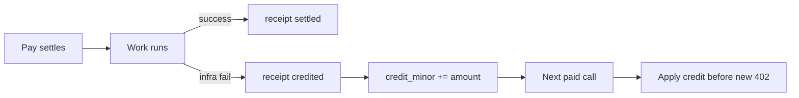
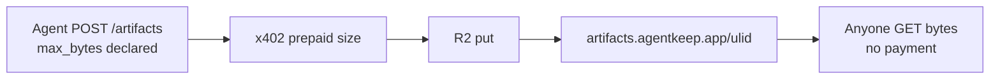
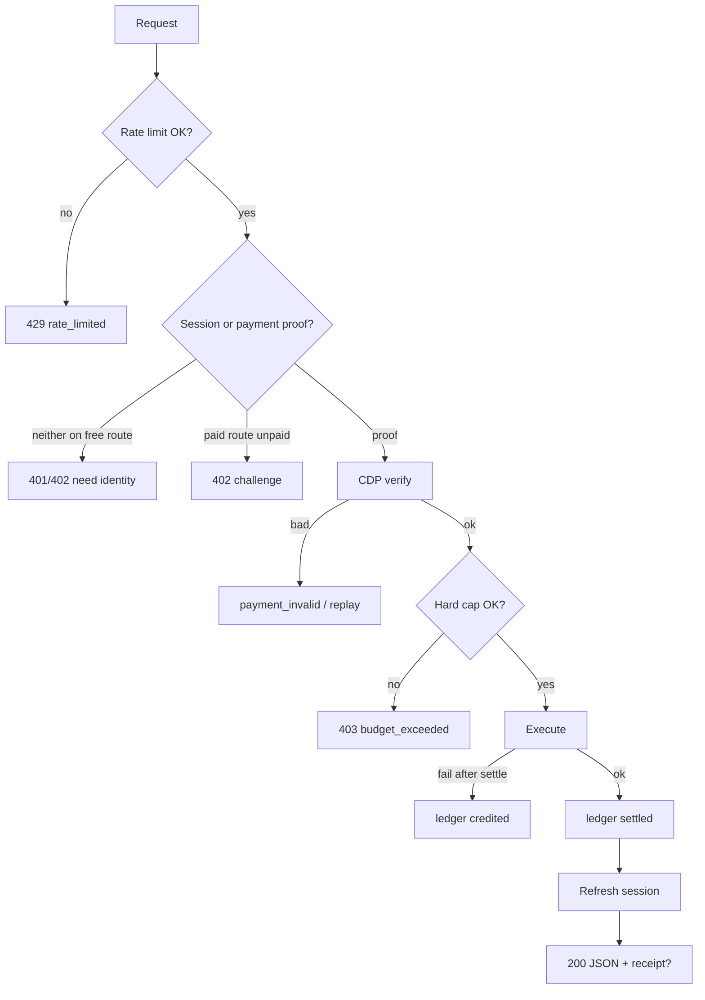

# 22 — Architecture, flows & build plan

High-level view for humans before code. Product locks live in [`21-prebuild-decisions.md`](21-prebuild-decisions.md).

**For implementation:** use the extensive phased plan [`24-engineering-build-plan.md`](24-engineering-build-plan.md) and AI protocol [`../AGENTS.md`](../AGENTS.md). This file stays the diagram-oriented overview.

---

## 1. Build flow (2–3 week solid origin)

```mermaid
flowchart LR
  subgraph W0["Week 0 — Docs freeze"]
    D1[21 decisions]
    D2[OpenAPI align]
    D3[Accounts only — domains later]
  end

  subgraph W1["Week 1 — Skeleton + money"]
    A1[ADR host/DB/blob]
    A2[TS API skeleton]
    A3[x402 + CDP verify]
    A4[Ledger + hard caps]
    A5[Session mint]
  end

  subgraph W2["Week 2 — Primitives"]
    B1[Memory]
    B2[Artifacts + CDN]
    B3[Fetch SSRF]
    B4[Budget + receipts]
    B5[Owner bind + notify]
  end

  subgraph W3["Week 3 — Close loops + ship"]
    C1[Inbox email]
    C2[Trust probe]
    C3[Staging acceptance]
    C4[Buy domains + DNS cutover]
    C5[Canary on final domain → x402scan]
  end

  W0 --> W1 --> W2 --> W3
```



### Week-by-week checklist

| Phase | Ship | Done when |
|-------|------|-----------|
| **0** | Decisions + OpenAPI + vendor accounts | `21` + OpenAPI match; CDP/payTo ready (**domains later**) |
| **1** | Pay path on staging host URL | Unpaid→402→pay→200; session works |
| **2** | Core primitives | Memory + artifacts + fetch + budget + one notify path |
| **3** | Second channel + inbox + trust + **domain cutover** | Staging `18` green → buy `agentkeep.app` → DNS → canary → list |

**Slip order (if behind):** cut `/trust` → cut inbox → ship single notify channel only → keep money+memory+artifacts+fetch+budget.  
**Domains/DNS:** only after staging acceptance (see `24` P12).

---

## 2. Architecture (logical)



### Component notes

| Box | Job |
|-----|-----|
| API Edge | Route, validate, rate-limit, map wallet_id |
| Payment verify | CDP x402; bind resource/amount/nonce |
| Budget gate | Hard daily cap **before** work; apply credits |
| Session | 15m token for free GETs after paid settle |
| Ledger | Append-only receipts; `credited` offsets spend |
| Memory KV | Wallet-scoped; default TTL 7d |
| Object store | Public ULID URLs; allowlisted types |
| Fetch / Trust | Shared SSRF denylist |
| Notify | Tickets + email/TG delivery + optional callback |
| Inbox | Inbound email only → poll API |
| Owner ops | Bind channels, OTP, caps, delete |

### Deployment sketch (pre-ADR)

```
agentkeep.app          → static docs / llms / skill / human notify pages
api.agentkeep.app      → TS API (Fly or Render Starter)
artifacts.agentkeep.app→ R2/S3 + CDN
inbox.agentkeep.app    → MX → inbound worker → DB
```

---

## 3. User flows

### 3a. Agent happy path (research → keep → escalate)



### 3b. Owner bind + kill switch



### 3c. Payment failure → credit offset



### 3d. Public artifact



---

## 4. Request pipeline (every tenant call)



---

## 5. What “solid” means before public mainnet

1. Acceptance suite in `18` green (including owner bind, session free-GET, SSRF, credits)  
2. Default $2 cap + kill switch verified  
3. Canary wallet 48–72h  
4. Discovery files match live OpenAPI prices  
5. Pause switch tested (`payment_unavailable`)  

---

## 6. Related docs

- Decisions: [`21-prebuild-decisions.md`](21-prebuild-decisions.md)  
- Boxes detail: [`16-architecture-overview.md`](16-architecture-overview.md)  
- Payments: [`10-payments-x402-mpp.md`](10-payments-x402-mpp.md)  
- Threats: [`11-security-threat-model.md`](11-security-threat-model.md)  
