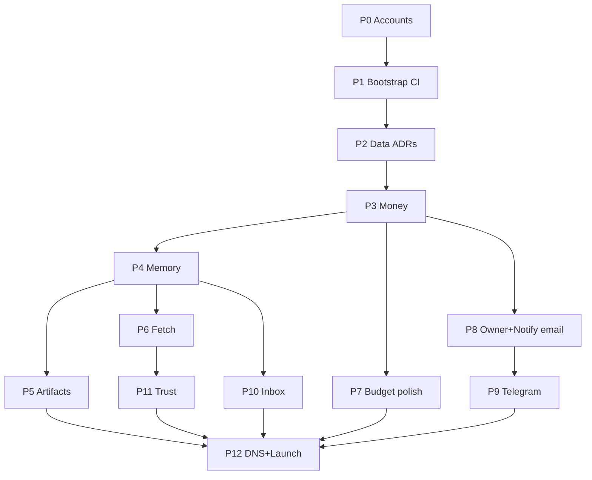

# 24 — Engineering build plan (start → production)

**Audience:** Humans + AI coding agents building AgentKeep.  
**Hackathon calendar:** Use [`28-hackathon-impl-test-prod-roadmap.md`](28-hackathon-impl-test-prod-roadmap.md) (H0–H8) for *when*; keep this file for *edge-case tables* and classic P-phase DoD detail.  
**Eligibility / rail:** [`27-algorand-x402-challenge.md`](27-algorand-x402-challenge.md) wins on Algorand + GoPlausible.  
**Product law:** [`21-prebuild-decisions.md`](21-prebuild-decisions.md) wins on product semantics.  
**Flows:** [`22-flows-and-build-plan.md`](22-flows-and-build-plan.md).  
**Acceptance:** [`18-acceptance-test-plan.md`](18-acceptance-test-plan.md).  
**Cheap infra + manual connections:** [`25-cheap-infra-guide.md`](25-cheap-infra-guide.md) — **Fly + Neon + R2**.  
**AI entrypoint:** repo root [`AGENTS.md`](../AGENTS.md).

This is an **MNC-style delivery plan**: phased vertical slices, mandatory tests per phase, explicit edge cases, Definition of Done, and no “big bang” mainnet.

**Legend**

| Tag | Meaning |
|-----|---------|
| 👤 **HUMAN** | Must be done by a person (money, accounts, DNS, approvals). AI must stop and wait. |
| 🤖 **AI/ENG** | Coding agent or engineer may implement. |
| 🤝 **GATE** | Human must explicitly approve before next phase starts. |

Every phase below has a **Human intervention** subsection with numbered steps when 👤 work is required.

> **Note:** Challenge facilitator is **GoPlausible** (not CDP). Where this doc still says CDP, treat as historical — follow `27`/`10`/`28`.

---

## 0. Operating system (how we build)

### 0.1 Principles

1. **Spec before code** — OpenAPI + `21` are contracts; code implements them.  
2. **Vertical slices** — each phase ships a working path with tests, not orphaned layers.  
3. **Test gates** — a phase is not done until its automated tests are green in CI.  
4. **Fail closed** — payment, SSRF, tenancy, caps: prefer deny over allow.  
5. **Idempotent money** — never double-charge; prefer `credited` over silent loss.  
6. **Observability first** — every request has `request_id`; money paths emit structured events.  
7. **Slip order** — if schedule slips: drop `/trust` → inbox → second notify channel. Never drop pay/session/memory isolation.  
8. **No drive-by scope** — do not add features not in OpenAPI/`21` without a written decision.

### 0.2 Roles (even if one person / one AI)

| Role | Responsibility |
|------|----------------|
| Product | Spec truth (`21`, OpenAPI) |
| Eng | Implement + unit/integration tests |
| QA | Phase acceptance + edge matrices |
| Ops | Secrets, domains, pause switch, canary |
| Security | SSRF, tenancy, artifact allowlist review |

AI agents must **simulate** Eng+QA gates: write tests in the same PR as code.

### 0.3 Branching & PR policy

```
main          — always deployable; protected
phase/N-name  — phase work
fix/*        — hotfixes only after canary
```

| Rule | Detail |
|------|--------|
| PR size | Prefer &lt; 400 LOC diff excluding generated; split otherwise |
| Required checks | `typecheck`, `unit`, `integration` (phase-appropriate), `lint` |
| Review | Human or second-agent review for money/SSRF/tenancy |
| Merge | Squash; message references phase id (`phase-2: x402 verify`) |
| No `--no-verify` | Hooks must pass |

### 0.4 Environments

| Env | Purpose | Money |
|-----|---------|--------|
| `local` | Docker compose + mocked CDP | Fake settle |
| `staging` | Real stack, Base mainnet **tiny** payTo or CDP test mode if available | Real USDC only with canary wallet allowlist |
| `production` | Public origin | Mainnet + default $2 cap |

**Config via env only** — never commit secrets. Required keys documented in `.env.example`.

### 0.5 Test pyramid (mandatory)

```
        E2E / acceptance (18)     ← few, slow, staging
       /                     \
  Integration (API + DB)        ← per phase
 /                         \
Unit (pure functions)            ← majority
```

| Layer | Tools (recommended) | What |
|-------|---------------------|------|
| Unit | Vitest / Jest | Pricing math, SSRF URL parse, resource hash, credit apply, TTL |
| Integration | Vitest + testcontainers or embedded PG | HTTP handlers + DB + mocked CDP |
| Contract | OpenAPI validator (schemathesis / openapi-response-validator) | Response shapes |
| E2E | Scripted agent wallet against staging | `18` checklist |
| Load (phase 11+) | k6/autocannon smoke | Rate limits, no crash |

**Rule:** Bugfix = regression test first, then fix.

### 0.6 Definition of Done (every phase)

- [ ] Implements only in-scope OpenAPI paths for this phase  
- [ ] Unit + integration tests green in CI  
- [ ] Error codes from [`13-error-catalog.md`](13-error-catalog.md) only  
- [ ] Structured logs with `request_id`, hashed `wallet_id`, `route`  
- [ ] No cross-wallet data access (isolation test)  
- [ ] README/phase notes updated if operator steps changed  
- [ ] No TODO that blocks the phase’s happy path  
- [ ] Phase exit checklist signed (human or recorded in PR)

### 0.7 State, loading, waits (API semantics)

There is no SPA UI in v1 API, but **async human/system waits** must be explicit:

| Concern | Pattern |
|---------|---------|
| Payment pending | Client handles 402; server never half-executes paid work before verify |
| Notify wait | Ticket `pending` → poll; never block HTTP for `max_wait_seconds` |
| OTP / email confirm | `202` + out-of-band; poll budget/owner state |
| Inbox provision | Lazy on first GET; idempotent |
| Artifact upload | Sync in v1 (wait for put); reject if timeout |
| Credits | Atomic DB update with ledger row |
| Rate limit | Immediate `429` + `Retry-After` — no queue pretence |
| Upstream fetch/trust | Bound waits (fetch ≤ configured; trust ≤ 3s) |

**Never** leave resources in ambiguous states: use explicit enums (`pending|approved|…`, `settled|credited|failed`).

### 0.8 Suggested monorepo layout (week 1 ADR may adjust)

```
/apps
  /api                 # TypeScript HTTP API
  /worker              # timeouts, expiry, inbound email (can start in api)
  /web-owner           # minimal pages: confirm-email, notify resolve
/packages
  /shared              # money math, errors, SSRF, openapi types
/tests
  /unit
  /integration
  /e2e
/specs/openapi.yaml
/docs/...
AGENTS.md
```

### 0.9 Human intervention protocol (global)

AI/agents **must not** pretend to complete 👤 tasks. When blocked:

1. Mark phase status `blocked` on the tracking board.  
2. Paste the phase’s **Human intervention** checklist to the human.  
3. Wait for human to reply `P{N} human done` (or check off boxes in this file).  
4. Only then continue 🤖 work or open the next phase.

#### Master human checklist (whole project)

| When | Human must… | Details in |
|------|----------------|------------|
| Before coding | CDP + payTo address + email/TG accounts (no domains yet) | P0 |
| Before real payments | CDP wired + canary USDC funded | P0, P3 |
| Before staging deploy | Host account + secrets (use **ephemeral host URL**, not custom DNS) | P2, P3 |
| Before artifacts | R2/S3 bucket; public URL via provider/default host URL | P5 |
| Before notify E2E | Email API key; use provider test domain / catch-all until cutover | P8 |
| Before Telegram | BotFather + webhook to staging host URL | P9 |
| Before inbox E2E | Provider inbound on temporary hostname (full MX on final domain in P12) | P10 |
| **After** staging acceptance | **Buy domains + connect DNS** (api/artifacts/apex/inbox/mail) | **P12** |
| Before public launch | Canary on final domain, remove allowlist, x402scan | P12 |
| Every money PR | Review / approve merge to `main` | P3+ |
| Production promote | Manual deploy approval | P12 |

#### Where secrets live (human-owned)

Store in a password manager (1Password/Bitwarden) — **never** in git:

- Domain registrar login  
- Cloudflare (or DNS) login — **needed at P12**, not P0  
- Coinbase CDP API keys  
- `payTo` wallet seed / private key (prefer hardware; only address in env)  
- Host API tokens (Fly/Render)  
- Postgres / R2 keys  
- Resend/Postmark API key  
- Telegram bot token  
- GitHub Actions secrets  

---

## Phase map (overview)

| Phase | Name | Approx | Human? | Exit artifact |
|-------|------|--------|--------|---------------|
| **P0** | Prep (accounts only) | 0.5d | 👤 medium | CDP, payTo, email/TG — **no DNS yet** |
| **P1** | Repo bootstrap & CI | 1d | 🤝 light | Empty API hello + CI green |
| **P2** | Data plane & ADRs | 1d | 👤 host accounts | Migrations, wallets table |
| **P3** | Money path | 2–3d | 👤 CDP + 🤝 review | Pay→200→session |
| **P4** | Memory | 1–1.5d | 🤝 review | CRUD + isolation |
| **P5** | Artifacts | 1.5–2d | 👤 R2 (temp URL) | Upload + public GET on provider URL |
| **P6** | Fetch | 1–1.5d | 🤝 review SSRF | Markdown + SSRF tests |
| **P7** | Budget/receipts polish | 0.5–1d | 🤝 light | Credits apply, export |
| **P8** | Owner + Notify (email) | 2–2.5d | 👤 email API + UX (temp domain OK) | Bind→notify→approve |
| **P9** | Notify Telegram | 1d | 👤 BotFather | Dual channel |
| **P10** | Inbox | 1.5–2d | 👤 temp inbound | Inbound poll (final MX in P12) |
| **P11** | Trust | 0.5–1d | 🤝 light | Probe + SSRF |
| **P12** | Domains + DNS cutover + launch | 1–2d | 👤 heavy | Buy domain, DNS, canary, list |

**Critical path:** P0→P1→P2→P3→P4. Everything else fans out after money works.

### Domain / DNS policy (locked)

**Do not buy or configure custom domains until P12.**

| Stage | Public base URL |
|-------|-----------------|
| Local | `http://localhost:<port>` |
| Staging | Host ephemeral URL (e.g. `https://agentkeep-staging.onrender.com` or `*.fly.dev`) |
| Artifacts (pre-cutover) | R2.dev public URL / signed CDN URL / `https://<staging>/artifacts/…` |
| Owner pages (pre-cutover) | Same staging host path `/owner/…`, `/n/…` |
| Email (pre-cutover) | Provider sandbox / onboarding domain, or provider subdomain — **not** `agentkeep.app` |
| Inbox (pre-cutover) | Provider temporary inbound address if available; else mock webhook tests + defer real MX to P12 |
| Production | Only after P12 purchase: `api.agentkeep.app`, `artifacts.agentkeep.app`, etc. |

OpenAPI/`21` keep **final** hostnames as the contract; runtime `PUBLIC_API_BASE`, `ARTIFACTS_BASE`, `OWNER_WEB_BASE` env vars point at staging URLs until cutover.

### Cheap infra (locked intent — details in `25`)

**Spend gate:** Do not pay for staging/prod hosts until validation phases **V0→V2** in [`26-users-competition-gtm-validation.md`](26-users-competition-gtm-validation.md) pass (demand → dogfood → closed pilot money gates). Local/Docker first.

| Layer | Default | ~Staging cost |
|-------|---------|----------------|
| API | Railway **or** Fly **or** Render Starter | ~$5–7 |
| Postgres | **Neon** (free/launch) | ~$0–5 |
| Artifacts | **Cloudflare R2** | ~$0 |
| Email | **Resend** | ~$0 |
| Docs | Cloudflare Pages | $0 |
| **Target** | | **≤ $15/mo staging** |

**Do not** use AgentCash x402 “rent-a-VM” or third-party x402 object stores as primary infra (see `25` §2.2). Manual vendor connection steps live in `25` §5.



---

## P0 — Prep (accounts only — no domains)

### Goals
Create vendor accounts and secrets needed to **test**.  
**Do not buy domains or configure DNS yet** (that is P12).

### 👤 Human intervention (required)

Complete these before saying `P0 human done`.

#### H0.1 — Coinbase CDP
1. Sign in to Coinbase Developer Platform / CDP console.
2. Create project `agentkeep-staging`.
3. Enable x402 / payment verify APIs per current CDP docs.
4. Create API credentials with minimum verify permissions; copy once.
5. Store in password manager (`CDP_API_KEY` / `CDP_API_SECRET` — exact names after spike).
6. Plan `PAYMENT_MODE=mainnet` for v1 (Base USDC).

#### H0.2 — `payTo` treasury wallet (Base)
1. Create a **new** receive-only wallet for AgentKeep USDC (hardware preferred).
2. Save **address only** as `PAYTO_ADDRESS` in the vault.
3. Store seed/private key offline — **never** give seed to AI, chat, or CI.
4. Fund tiny Base ETH only if the facilitator requires it for receive.
5. Fund **$5–10 USDC on Base** when ready for first real staging pay (can wait until P3).

#### H0.3 — Email + Telegram accounts (idle OK)
1. Create Resend or Postmark account; save login in vault.
2. **Do not** buy/attach `agentkeep.app` yet — use provider’s test/onboarding sending domain when P8 starts.
3. Telegram → BotFather → `/newbot` → save `TELEGRAM_BOT_TOKEN` (idle until P9).

#### H0.4 — Vault inventory checklist
- [ ] CDP keys stored
- [ ] `PAYTO_ADDRESS` stored
- [ ] Email provider account
- [ ] Telegram bot token
- [ ] Confirmed: domains/DNS deferred to **P12**

**Gate:** Reply `P0 human done` when the boxes above are checked.

### Tasks
1. 👤 H0.1–H0.4
2. 🤖 After human done: draft `.env.example` including `PUBLIC_API_BASE`, `ARTIFACTS_BASE`, `OWNER_WEB_BASE` (staging placeholders)

### Edge cases / risks
- Domain availability may change before P12 → re-check `agentkeep.app` / `.net` at cutover; fallback `.net` if needed (update `21`)
- CDP sandbox vs mainnet → document `PAYMENT_MODE`

### Tests
- Doc: `.env.example` names only (no real secrets)

### DoD
- [ ] CDP + payTo + email/TG accounts ready
- [ ] `.env.example` lists required vars
- [ ] Explicitly **no** custom DNS required
- [ ] `P0 human done`

### AI instructions
- Do **not** tell the human to buy domains in P0.
- Use localhost / ephemeral host URLs in code defaults until P12.
- **Block** until `P0 human done`.

---

## P1 — Repo bootstrap & CI

### Goals
TypeScript API skeleton, lint, typecheck, unit test runner, CI on PR.

### 👤 Human intervention

#### H1.1 — GitHub remote
1. Create private GitHub repo (or connect existing folder).
2. Protect `main` (PR required; status checks once CI exists).
3. Do not hand AI a PAT with admin unless intentional.

#### H1.2 — First CI
1. After AI opens PR with workflow: confirm Actions run green.
2. Add Actions secrets only if needed (usually none in P1).

#### H1.3 — Gate
1. Skim P1 PR (health only).
2. Merge when CI green.
3. Reply `P1 human done`.

### Tasks
1. 🤖 Monorepo + `GET /health` + lint/typecheck/vitest + GitHub Actions + static OpenAPI serve
2. 👤 H1.1–H1.3

### Edge cases
- Pin Node 22 LTS if CI flaky
- Later: OpenAPI drift check in CI

### Tests
| Type | Cases |
|------|-------|
| Unit | health → `{status:"ok"}` |
| CI | red PR cannot merge |

### DoD
- [ ] Health 200 locally + CI
- [ ] Strict TypeScript
- [ ] `P1 human done`

### AI instructions
- Boring stack (Hono/Fastify). No paid routes yet.
- Ask human for remote if missing.

---

## P2 — Data plane & ADRs

### Goals
Persist wallets, ledger, sessions; ADRs for host/DB/blob.

### 👤 Human intervention

Follow the click-by-click guides in [`25-cheap-infra-guide.md`](25-cheap-infra-guide.md) §5. Summary:

#### H2.1 — Pick stack + approve ADRs
1. Read `25` §3 recommendation (Railway+Neon+R2 **or** Fly+Neon+R2 **or** Render+Neon+R2).  
2. Read AI ADR-0001/0002/0003.  
3. Comment: `ADR approved: host=<…> db=Neon blob=R2`.  
4. Fill decision table at bottom of `25` §9.

#### H2.2 — Create Neon (manual)
1. Complete `25` §5.2 (Neon project + staging branch + connection URI in vault).  
2. Set a billing alert if leaving free tier.

#### H2.3 — Create API host (manual)
1. Complete **one** of: `25` §5.3 Railway / §5.4 Fly / §5.5 Render.  
2. Deploy empty/health service; copy ephemeral URL.  
3. Set host secrets: at least `DATABASE_URL` from Neon.  
4. Set `PUBLIC_API_BASE` and `OWNER_WEB_BASE` to that URL.  
5. Confirm: `curl -sS "$PUBLIC_API_BASE/health"`.

#### H2.4 — Billing + gate
1. Set host spend alert ~$20 (`25` §8).  
2. Confirm AI can run migrations against staging DB (you paste URL into host secrets only).  
3. Reply `P2 human done`.

### Tasks
1. 🤖 ADRs citing `25` + migrations + repos + docker-compose  
2. 👤 H2.1–H2.4 (full connection steps in `25`)

### State model (wallet)
```
(none) --first settled pay--> active
active --ops--> suspended | banned
```

### Edge cases
- Transactional migrations
- Use DB `now()` for expiry

### Tests
| Type | Cases |
|------|-------|
| Integration | migrate; unique wallet_id |
| Unit | wallet_id lowercase hex canonicalize |

### DoD
- [ ] ADRs merged with approval note
- [ ] Migrations in CI
- [ ] Staging DB in vault
- [ ] `P2 human done`

### AI instructions
- Never print DB passwords in PR/logs.

---

## P3 — Money path (critical)

### Goals
Unpaid→402→verify→cap→work→ledger→session.

### 👤 Human intervention

#### H3.1 — Wire CDP secrets to staging
1. Set host secrets: CDP keys, `PAYTO_ADDRESS`, `PAYMENT_MODE=mainnet`, `PAYMENT_PAUSE=false`.
2. Redeploy; confirm `/health` 200; confirm keys not logged.

#### H3.2 — Canary wallet
1. Create a **separate** test wallet.
2. Fund ~$5–10 USDC on Base (+ tiny ETH if needed).
3. Save address as `CANARY_WALLET_ADDRESS`.
4. Give AI **address only** for allowlist.

#### H3.3 — First real payment
1. Unpaid paid-route → inspect `402` body.
2. Pay with canary via CDP/x402 flow.
3. Retry → `200`, receipt `settled`, header `X-AgentKeep-Session`.
4. Confirm funds/accounting to `PAYTO_ADDRESS`; save tx hash in `AgentKeep/canary-p3`.

#### H3.4 — Pause drill
1. Set `PAYMENT_PAUSE=true`; restart.
2. Expect `503 payment_unavailable`.
3. Set `false` again.

#### H3.5 — Review gate
1. Human review money PR (replay, caps, double-charge).
2. Merge after review + H3.3/H3.4.
3. Reply `P3 human done`.

### Tasks
1. 🤖 Challenge, CDP adapter (mock+real), nonce, caps, credits, ledger, session, pause, idempotency, thin paid route
2. 👤 H3.1–H3.5

**Split:** P3a mock-green → P3b human real pay (H3.3).

### State machines

**Ledger:** verify+work ok → `settled`; verify ok work fail → `credited`; verify fail → no charge / `failed`.

**Session:** mint/refresh on **settled** only; free GET needs valid session or proof.

### Edge cases (must test)
| Case | Expected |
|------|----------|
| Missing payment | 402 |
| Replay nonce | 409 `payment_replay` |
| Underpay | 402 `payment_insufficient` |
| Cap exceeded | 403 `budget_exceeded`, no work |
| Pause on | 503 `payment_unavailable` |
| Full/partial credit | apply credit; 402 remainder |
| Parallel spends | row lock; ≤1 overshoot |
| Clock skew >60s | `payment_invalid` |
| Idempotency replay | same receipt |
| Work throws after verify | `credited`; no session refresh |

### Tests
| Layer | Cases |
|-------|-------|
| Unit | prices, credit math, resource hash, nonce |
| Integration | 402→mock pay→200; replay; cap; pause; session |
| Manual 👤 | H3.3 |

### DoD
- [ ] Mock path green
- [ ] Real staging pay (H3.3)
- [ ] Pause drill (H3.4)
- [ ] Money PR reviewed
- [ ] `P3 human done`

### AI instructions
- Mock CDP in automated tests by default.
- Never request `payTo` private key.

---

## P4 — Memory

### Goals
Wallet-scoped KV; default TTL 7d; free GET + session.

### 👤 Human intervention

#### H4.1 — Review gate
1. Confirm isolation tests pass in CI.
2. Spot-check wallet A cannot read B.
3. Merge; reply `P4 human done`.

### Tasks
1. 🤖 memory table + PUT/GET/DELETE/LIST + expiry + rate limit
2. 👤 H4.1

### Edge cases
| Case | Expected |
|------|----------|
| Bad key / oversize | 400 / 413 |
| Expired / cross-wallet | 404 |
| LIST unpaid / GET no session | 402 / 401 |

### Tests
Round trip; TTL; isolation; oversize; rate limit.

### DoD
- [ ] OpenAPI paths live
- [ ] `P4 human done`

### AI instructions
- Do not log values. Isolation test mandatory.

---

## P5 — Artifacts

### Goals
Prepaid `max_bytes` upload; public CDN; allowlist; 90d.

### 👤 Human intervention

#### H5.1 — Object storage (no custom domain)
Follow [`25` §5.6](25-cheap-infra-guide.md) (R2 bucket, tokens, `ARTIFACTS_BASE`).  
1. Create R2 bucket `agentkeep-artifacts-staging`.  
2. Create restricted access keys; enable public read via r2.dev **or** serve via API.  
3. Store `R2_*` + `ARTIFACTS_BASE` in vault → staging host secrets.  
4. Redeploy; **skip** custom domain until P12.

#### H5.2 — Abuse spot-check
1. Upload small JSON via API; open the **temporary** public URL.
2. Upload `.html` → must `415`.
3. Reply `P5 human done`.

### Tasks
1. 🤖 Blob adapter + upload + public serve + allowlist + quotas
2. 👤 H5.1–H5.3

### Edge cases
Oversize / bad type / quota / expiry / path traversal — see prior matrix.

### Tests
Automated hash round-trip + allowlist; manual H5.3.

### DoD
- [ ] Public URL works unpaid (temp base)
- [ ] Bucket live
- [ ] `P5 human done`

### AI instructions
- Parameterize `ARTIFACTS_BASE`; do not hardcode `artifacts.agentkeep.app` in runtime until P12 cutover.
- Document temporary URL for human in the PR.

---

## P6 — Fetch

### Goals
Flat $0.01; markdown; SSRF; timeouts.

### 👤 Human intervention

#### H6.1 — SSRF review gate
1. Review SSRF unit matrix (≥15 cases) in PR.
2. Optional: staging fetch of a safe public page.
3. Merge; reply `P6 human done`.

### Tasks
1. 🤖 SSRF + fetch + markdown
2. 👤 H6.1

### Edge cases
localhost / private DNS / metadata / timeout / non-HTTP / truncate.

### Tests
Table-driven SSRF + mock HTTP server.

### DoD
- [ ] ≥15 SSRF cases green
- [ ] `P6 human done`

### AI instructions
- Shared SSRF module for fetch/trust/callbacks.

---

## P7 — Budget & receipts polish

### Goals
Budget GET; receipts; credits visible.

### 👤 Human intervention

#### H7.1 — Manual sanity
1. Canary session: `GET /v1/budget` — cap 2_000_000, credits, spent.
2. `GET /v1/budget/receipts` — prior receipts present.
3. Reply `P7 human done`.

### Tasks
1. 🤖 Budget + receipts + credit sweeper
2. 👤 H7.1

### DoD
- [ ] OpenAPI Budget schema match
- [ ] `P7 human done`

---

## P8 — Owner + Notify (email)

### Goals
Bind email, OTP, caps, notify, human approve pages, callbacks.

### 👤 Human intervention

#### H8.1 — Email API on temporary sending identity
Follow [`25` §5.7](25-cheap-infra-guide.md).  
1. Create Resend API key; store `EMAIL_API_KEY`.  
2. Use provider test/onboarding from-address — **not** `agentkeep.app`.  
3. Set `EMAIL_FROM` + `OWNER_WEB_BASE=https://<staging-host>`; redeploy.  
4. Send Resend dashboard test email to yourself.  
5. SPF/DKIM on final domain deferred to P12 (`25` §5.11).

#### H8.2 — You are the owner (E2E on staging URL)
1. `POST /v1/owner/bind/email` with your email → open magic link on **staging host**.
2. Request OTP → `PUT /v1/owner/caps` (e.g. $5).
3. `POST /v1/notify` → Approve via email link (staging URL).
4. Poll until `approved`.
5. Restore caps / test kill switch `0` if desired.
6. Reply `P8 human done`.

### Tasks
1. 🤖 Owner API + web pages + email + notify + callback SSRF + timeout worker
2. 👤 H8.1–H8.2

### State machine (ticket)
`pending` → `approved|denied|answered|timeout|cancelled` (terminal forever).

### Edge cases
Unbound → `channel_not_bound`; token reuse invalid; OTP lockout; callback SSRF.

### Waits
Agent polls; email may take &lt;1 min (check spam).

### Tests
Mocked email automated; manual H8.3.

### DoD
- [ ] Human approve without API knowledge (staging URLs)
- [ ] Email works via provider temp identity
- [ ] `P8 human done`

### AI instructions
- All links use `OWNER_WEB_BASE` env (staging until P12).
- No agent-supplied recipient emails.
- Do not require custom domain DNS in P8.

---

## P9 — Telegram notify

### Goals
Deep-link bind; inline buttons; `telegram|both`.

### 👤 Human intervention

#### H9.1 — Bot wiring
Follow [`25` §5.8](25-cheap-infra-guide.md).  
1. BotFather token → staging secret `TELEGRAM_BOT_TOKEN`.  
2. `setWebhook` to `https://<staging-host>/internal/telegram/webhook` + `TELEGRAM_WEBHOOK_SECRET`.  
3. Confirm webhook info via Telegram `getWebhookInfo`.

#### H9.2 — Manual TG E2E
1. `POST /v1/owner/bind/telegram` → open deep link within 30m → `/start`.
2. Notify with `channel: telegram` or `both`.
3. Tap Approve → poll `approved`.
4. Reply `P9 human done`.

### Tasks
1. 🤖 Telegram worker + bind + keyboards
2. 👤 H9.1–H9.2

### DoD
- [ ] Email-only still works if TG unbound
- [ ] `P9 human done`

---

## P10 — Inbox

### Goals
Provision address; inbound email; list/ack; strip attachments.

### 👤 Human intervention

#### H10.1 — Temporary inbound (no custom MX yet)
**Preferred:** provider temporary inbound / test address that POSTs to staging webhook.  
**Alternative:** skip real SMTP; AI ships webhook simulator + you only run H10.2 mock; real MX waits for P12.

1. Enable inbound webhook on provider pointing to `https://<staging-host>/internal/inbound/email`.
2. Set `INBOUND_EMAIL_SECRET` in staging secrets.
3. If provider requires a subdomain they control (not yours), use that until P12.
4. **Do not** set MX on `inbox.agentkeep.app` until P12.

#### H10.2 — Ingest test
1. Paid `GET /v1/inbox` → note `inbox_address` (may be staging-form address).
2. Send email to the **temporary** inbound address **or** POST a signed test payload via provider “send test”.
3. Poll until visible; ack.
4. Reply `P10 human done`.

### Tasks
1. 🤖 Ingest + list/ack + caps
2. 👤 H10.1–H10.2

### DoD
- [ ] Webhook ingest works on staging host
- [ ] Final MX deferred to P12 (documented)
- [ ] `P10 human done`

### AI instructions
- Support temp inbound + final `inbox.agentkeep.app` via config.
- Document P12 MX cutover steps in runbook draft.

---

## P11 — Trust

### Goals
`GET /v1/trust` per `21`.

### 👤 Human intervention

#### H11.1 — Spot-check
1. Pay for trust probe against a known 402 and a normal 200 URL.
2. Confirm `looks_x402` and self-`*.agentkeep.app` block.
3. Reply `P11 human done`.

### Tasks
1. 🤖 Trust probe + rate limit
2. 👤 H11.1

### DoD
- [ ] Acceptance H green
- [ ] `P11 human done`

---

## P12 — Domain purchase, DNS cutover, canary, launch

### Goals
Only **after** staging acceptance is green: buy domains, connect DNS, canary on final hosts, public list.

### 👤 Human intervention (do in order)

#### H12.0 — Staging acceptance (still on ephemeral URLs)
1. Open `docs/18-acceptance-test-plan.md`.
2. Tick every box on **staging host URL** (not custom domain).
3. Fill sign-off table with name + date.
4. **Do not buy domains until this passes.**

#### H12.1 — Buy domains (now)
1. Re-check availability of `agentkeep.app` and `agentkeep.net`.
2. Purchase both (or `.net` fallback if `.app` gone — update `21` + OpenAPI).
3. Enable WHOIS privacy + auto-renew.
4. Store order IDs in vault `AgentKeep/domains`.

#### H12.2 — DNS cutover
1. Create DNS zone (prefer Cloudflare) for `agentkeep.app`.
2. Point records to **production** (or staging-first if you want a dry run):
   - `api` → API host
   - `artifacts` → R2/custom domain or CDN
   - `@` / `www` → docs + owner pages
   - `inbox` → MX per email provider
   - mail auth: SPF/DKIM/DMARC for sending domain
3. Attach custom domain to R2/artifacts; update `ARTIFACTS_BASE`.
4. Set prod/staging env: `PUBLIC_API_BASE=https://api.agentkeep.app`, `OWNER_WEB_BASE=https://agentkeep.app`.
5. Wait for propagation; verify:
   - `dig api.agentkeep.app`
   - `curl -I https://api.agentkeep.app/health`
   - `curl -I https://artifacts.agentkeep.app/`
6. Redirect `agentkeep.net` → `.app` (optional).

#### H12.3 — Production secrets & deploy on final names
1. Create prod Postgres + R2 + host service if not already.
2. Set all prod secrets; redeploy.
3. Keep **canary allowlist** ON.

#### H12.4 — Canary 48–72h on final domain
1. Exercise memory, artifacts, fetch, notify, budget via `api.agentkeep.app`.
2. Pause drill once.
3. Write canary report (dates, tx hashes, issues).
4. If stable: clear allowlist.

#### H12.5 — Public listing
1. Confirm `https://agentkeep.app/llms.txt` + skill.
2. List on x402scan with final origin URL.
3. Fresh non-canary wallet: unpaid→402→pay→memory once.
4. Create `abuse@agentkeep.app` forward.
5. Reply `P12 human done — LIVE`.

### Tasks
1. 🤖 Discovery files, price CI, e2e against configurable base URL, load smoke, runbook with DNS checklist
2. 👤 H12.0–H12.5

### DoD
- [ ] Staging `18` signed **before** domain purchase
- [ ] Domains owned + DNS live
- [ ] Canary on final domain
- [ ] Listing live
- [ ] `P12 human done — LIVE`

### AI instructions
- Keep final hostnames in OpenAPI as contract; switch env bases at cutover.
- Provide a DNS record table in the PR for H12.2.
- Never require custom domains in earlier phases.

---

## Human reply cheatsheet

| You finished… | Reply to AI |
|---------------|-------------|
| P0 accounts (no DNS) | `P0 human done` |
| P1 merge | `P1 human done` |
| P2 ADRs + DB | `P2 human done` |
| P3 real pay + pause | `P3 human done` |
| P4 review | `P4 human done` |
| P5 bucket + temp URL spot-check | `P5 human done` |
| P6 SSRF review | `P6 human done` |
| P7 budget glance | `P7 human done` |
| P8 email E2E on staging URL | `P8 human done` |
| P9 Telegram E2E | `P9 human done` |
| P10 temp inbound / webhook test | `P10 human done` |
| P11 trust spot-check | `P11 human done` |
| Buy domain + DNS + launch | `P12 human done — LIVE` |

AI must treat missing reply as **blocked**.

---
## Cross-cutting edge-case register (ideate → own)

| ID | Area | Case | Owner phase |
|----|------|------|-------------|
| E01 | Money | Double-submit same payment proof | P3 |
| E02 | Money | Client pays wrong resource | P3 |
| E03 | Money | Cap race two parallel PUTs | P3 |
| E04 | Session | Stolen session header | P3 — short TTL; optional bind to wallet only |
| E05 | Memory | Unicode key normalization | P4 |
| E06 | Artifacts | Zip bomb / huge compressed | P5 — reject by raw size |
| E07 | Fetch | DNS rebinding between check and connect | P6 — connect to resolved IP / pin |
| E08 | Notify | XSS in question rendered on web page | P8 — escape |
| E09 | Notify | Open redirect on confirm links | P8 — fixed host |
| E10 | Callback | Slow callback blocks worker | P8 — timeout 3s async |
| E11 | Inbox | Email spoofing From | P10 — don’t trust From for auth |
| E12 | Trust | Amplification DDoS via trust | P11 — rate limit |
| E13 | Ops | Accidental cap raise script | P8 — OTP + max $50 |
| E14 | Privacy | Logs contain memory values | all — redact |
| E15 | Idempotency | Different body same key | bill once? **lock: first body wins; second conflict** |

Add new rows when bugs found; never delete — mark `mitigated`.

---

## CI pipeline (target)

```yaml
# conceptual
on: [pull_request, push]
jobs:
  quality:
    - install
    - lint
    - typecheck
    - unit
    - integration (postgres service)
    - openapi-diff / spectral lint
  e2e-staging:
    if: main
    - migrate
    - e2e against staging (secrets)
```

**Deploy:** staging on PR merge to main; production manual approve after canary.

---

## Observability & incident hooks

| Signal | Alert idea |
|--------|------------|
| `payment_invalid` spike | CDP misconfig |
| `credited` rate high | downstream bugs |
| p95 latency fetch | upstream or SSRF retries |
| 5xx rate | page on-call |
| ledger vs CDP mismatch | daily reconcile job |

Every phase must emit: `request_started`, `payment_verified`, `ledger_appended`, `request_finished`.

---

## AI agent build protocol (summary)

Full detail in [`AGENTS.md`](../AGENTS.md). Short form:

1. Read `21`, OpenAPI, this phase section.  
2. Implement **only** current phase scope.  
3. Write failing tests → implement → pass.  
4. Run isolation + money edge tests if touching P3+.  
5. Update OpenAPI only with explicit product decision.  
6. Stop and ask human if CDP/secrets/DNS required — paste the phase **Human intervention** steps from `24` and wait for `P{N} human done`.  
7. Do not start next phase until DoD checklist complete **and** human gate reply received when tagged 👤.  
8. On bug: add regression test in same change.  

---

## Phase tracking board (copy to issue tracker)

| Phase | Status | Human done? | Owner | Started | Exited | CI link |
|-------|--------|-------------|-------|---------|--------|---------|
| P0 | | ☐ `P0 human done` | | | | |
| P1 | | ☐ | | | | |
| P2 | | ☐ | | | | |
| P3 | | ☐ | | | | |
| P4 | | ☐ | | | | |
| P5 | | ☐ | | | | |
| P6 | | ☐ | | | | |
| P7 | | ☐ | | | | |
| P8 | | ☐ | | | | |
| P9 | | ☐ | | | | |
| P10 | | ☐ | | | | |
| P11 | | ☐ | | | | |
| P12 | | ☐ `… LIVE` | | | | |

Status: `todo | in_progress | blocked_on_human | done`.  
If waiting on 👤 steps, set `blocked_on_human` and paste the phase’s Human intervention checklist.

---

## Related

- Product locks: `21`  
- Diagrams: `22`  
- Re-audit: `23`  
- Acceptance: `18`  
- Threats: `11`  
- Errors: `13`  
