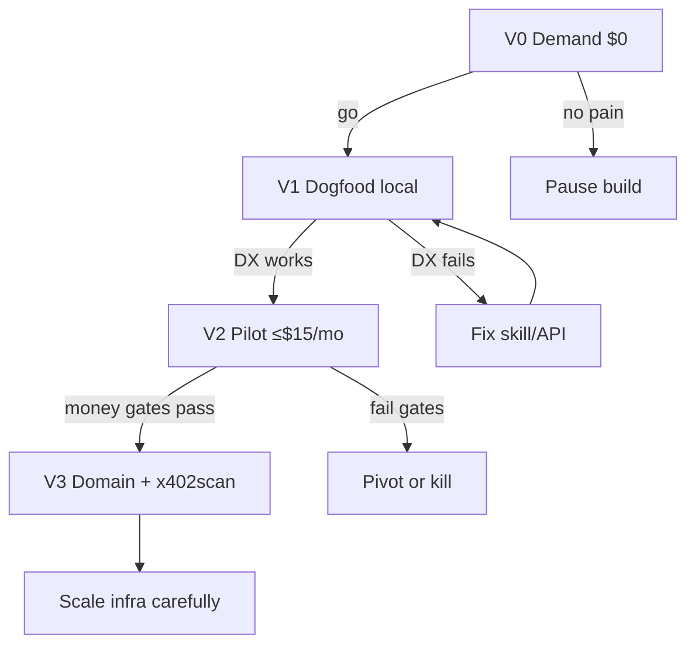

# 26 — Users, competition, validation & GTM (before infra spend)

**Purpose:** Decide *whether* AgentKeep earns money **before** committing to paid staging/prod infra.  
**Related:** personas `04`, competition `06`, metrics `15`, infra `25`, build `24`.

---

## 1. Who are our users?

### 1.1 Primary buyers (who pays USDC)

| User | What they are | Why they pay us |
|------|----------------|-----------------|
| **A — Runner agent** | LLM agent with a hot wallet (Cursor/Codex/custom runtime) | Needs memory/artifacts/notify mid-task; already pays x402 origins |
| **B — Principal (human)** | Funds the agent wallet | Will only keep funding if caps + receipts + human approve exist |
| **C — Integrator** | Skill / framework author | Wraps one continuity origin so their users don’t provision Redis/S3 keys |

**Money flow:** Principal funds wallet → Runner pays per call → we earn micro-USDC. Integrators amplify discovery; they rarely pay directly.

### 1.2 Not our users (v1)

- Teams wanting dashboards, SSO, seat licenses  
- Pure search/enrichment buyers (use StableEnrich etc.)  
- Traders needing market data  
- Anyone refusing crypto micropay  

### 1.3 Jobs that drive repeat spend

1. Store conclusion → later GET (memory habit)  
2. Upload file → pass URL to next tool (artifacts)  
3. Ask human before irreversible spend (notify — highest WTP in our band)  
4. Check budget before expensive external calls  
5. Fetch URL without standing up a scrape stack  

**Insight:** We win on **frequency × habit price**, not one luxury call.

---

## 2. Competition (who else is in the lane?)

### 2.1 Direct / adjacent (continuity + agent money)

| Competitor type | Examples | Overlap | Our edge |
|-----------------|----------|---------|----------|
| Partial x402 “budget helpers” | `x402helper.xyz` budget record/check (live usage on scanners) | Spend tracking only | Full OS: memory + artifacts + notify + inbox + ledger |
| Agent OS / marketplace routers | Agoragentic-style Agent OS | Discovery + paid execute | We stay **boring primitives**, no marketplace custody drama |
| Procedure merchants | K-2SO-style “inbox/notify procedures” as paid essays | Concept of agent inbox/notify | Real HTTP tickets, poll, email/TG, not a one-shot procedure blob |
| Agent mail | AgentMail / email-for-agents | Inbox | Bundle with budget + memory + pay-per-call |
| Object storage | Pinata, IPFS, R2 DIY, x402 R2 wrappers | Artifacts | Wallet tenancy + receipts + agent DX |
| KV SaaS | Redis Cloud, Upstash | Memory | No signup/keys; x402-native |
| Corp spend tools | Cards, SaaS budgets | Caps | Per-call agent ledger, not monthly SaaS |

*(AgentCash scan 2026-09: budget/check helpers and “agent inbox procedures” exist; **no dominant full continuity bundle** showed up as the default origin.)*

### 2.2 Indirect (steal attention, not the same product)

Search, scrape, LLM proxies, enrichment, image APIs — **crowded**. We must not become “another fetch wrapper.”

### 2.3 Honest moat

Distribution (x402scan + skill + uptime) + trust (isolation, caps, receipts) + **one origin for the loop**. Not patents.

---

## 3. What should we do better / easier? (to get used + paid)

Prioritize what makes Runners call us **without thinking** and Principals **keep the wallet funded**.

| Priority | Make it stupid-easy | Why money |
|----------|---------------------|-----------|
| P0 | Perfect `llms.txt` + `SKILL.md` + OpenAPI (prices, errors, when-not-to-use) | Agents discover & pay without human Slack |
| P0 | Session after first pay (free memory/budget GET) | Continuity without 402 spam mid-loop |
| P0 | Hard $2 daily cap default + kill switch | Principals fund more |
| P1 | Notify that works on email **or** TG in &lt;2 min bind | Highest WTP route ($0.02) |
| P1 | Artifacts: one POST → public URL (no IAM) | Share across tools |
| P1 | Typed errors + idempotency | Agents retry safely → more settled calls |
| P2 | `/trust` so agents preflight other 402s | Habit entry; cross-sell our origin |
| Avoid | Fancy dashboard, soft caps, multi-chain day one | Cost & delay without proven demand |

**Positioning line for agents:**  
> Use AgentKeep when you need state, files, human approval, or receipts — pay USDC, no API key.

---

## 4. Validate *before* spending on infra

### 4.1 Principle

**Demand proof → then pay for always-on host.**  
Until then: laptop + Docker + mocked CDP + optional tiny canary on free tiers only.

| Phase | Infra spend | What you learn |
|-------|-------------|----------------|
| **V0 Demand** | $0 | Do agents/humans want this story? |
| **V1 Dogfood** | $0–5 (Neon free, local) | Does the loop work for *your* agent? |
| **V2 Friends pilot** | ≤$15 staging (`25`) | Will strangers pay real USDC? |
| **V3 Scale** | Domains + prod (`24` P12) | Only if V2 clears money gates |

### 4.2 V0 — Demand tests ($0, 3–7 days)

**No product required.**

1. **Problem interviews (5–10 people)** who already run wallet agents / AgentCash-style stacks. Ask:  
   - Where does state die today?  
   - Have you paid for notify/memory?  
   - Would you pay $0.001–$0.02 per call for a bundle?  
2. **Fake door:** publish a static `llms.txt` + landing on free Cloudflare Pages describing the 6 primitives + waitlist wallet address. Measure:  
   - Unique agents hitting the page  
   - Waitlist signups / “ping me when live”  
3. **Scanner reconnaissance:** list *competitors* and note gaps (budget-only vs full OS). Confirm wedge still empty.  
4. **Smoke script (paper):** write the happy-path agent script from skill.md; if you can’t explain it in 15 lines, product is too hard.

**Go to V1 if:** ≥3 principals say “I’d fund $10–50/mo of agent spend for this” **or** ≥1 integrator wants to wrap it.

### 4.3 V1 — Dogfood on localhost ($0–5)

1. Build only **P1–P4 vertical**: pay mock → memory → session (per `24`).  
2. Run **your** Cursor/agent wallet against localhost with mock CDP first.  
3. Optional: one real CDP pay on local tunnel (ngrok) — still no paid PaaS.  
4. Track: settled calls, returning same day, errors.

**Go to V2 if:** you personally complete memory+notify (or memory+artifacts) with real USDC ≥20 times without cursing the DX.

### 4.4 V2 — Closed pilot (cheap staging ≤$15/mo)

1. Deploy staging on Railway/Fly/Render + Neon free + R2 (`25`).  
2. Invite **5–15** wallets (friends, agent builders, one integrator).  
3. Give each a $5–10 USDC budget and a one-pager skill.  
4. **No custom domain yet.**  
5. Instrument: revenue, returning wallets, route mix, 402→200 conversion (`15`).

---

## 5. How to test the pilot “are we making money?”

### 5.1 Money truth table (look at this weekly)

| Metric | Pilot pass (suggested) | Fail / iterate |
|--------|------------------------|----------------|
| Gross USDC received (7d) | ≥ **$25** from **≥5** distinct wallets | &lt;$5 or 1 wallet only |
| Returning wallets (used 2+ days) | ≥ **3** | Zero returners |
| Multi-primitive wallets | ≥ **40%** of active use ≥2 routes | &gt;90% fetch-only → wrong product |
| Notify attach rate | ≥1 resolve per invited principal | Nobody binds channel → trust story dead |
| Gross margin (after rails + hosting) | ≥ **50%** on pilot mix | Fetch/artifacts drowning COGS → reprice or cut |
| 402→200 conversion | ≥ **70%** of challenges that get a retry | Payment UX broken |
| Support load | &lt;1 human hour / day | DX not agent-ready |

### 5.2 Unit economics sanity (back of napkin)

Example pilot week: 5 wallets × 100 calls × ~$0.005 avg ≈ **$2.50/day ≈ $17.50/week**.  
Hosting $15/mo ≈ $3.75/week → **still green** if rails aren’t huge.  
If you need thousands of fetch calls to pay the bill, you’re a scrape proxy — fail.

### 5.3 Kill / pivot / scale rules

| Result | Action |
|--------|--------|
| Pass money + returners | Proceed P8–P12; buy domain; list on x402scan |
| Demand but bad DX | Fix skill/OpenAPI/session; extend pilot 2 weeks |
| Only you use it | Pause infra; more V0 interviews |
| Fetch-only revenue | Raise fetch price or drop fetch from marketing; push memory/notify |
| Margin &lt;30% | Cut COGS routes or raise prices before scale |

### 5.4 Pilot dashboard (minimum)

Log daily (even a spreadsheet):

- `gross_usdc`, `wallet_count`, `returning_wallets`  
- calls by route  
- `credited` count (quality bug signal)  
- top error codes  

---

## 6. Sales strategy (this is not SaaS sales)

**There is almost no human “sales call” in v1.** Agents buy. Humans fund.

| Motion | What you do | When |
|--------|-------------|------|
| **Agent-native distribution** | x402scan listing, perfect OpenAPI/llms/skill | After pilot pass |
| **Integrator SEED** | 3–5 skill authors wrap AgentKeep; you help their README | V2–V3 |
| **Principal trust** | One landing page: caps, receipts, notify — “fund your agent safely” | V2 |
| **Dogfood public** | Your own agents use AgentKeep in public workflows | Always |
| **No** | Outbound SDR, LinkedIn spam, enterprise RFP | Not v1 |

**Pricing as sales:** habit prices ($0.001–$0.02); notify at top of band; never surprise-raise.

**Expansion:** more returning wallets × more primitives — not seat upgrades.

---

## 7. Marketing strategy

### 7.1 Channels that matter

| Channel | Job | Cost |
|---------|-----|------|
| **x402scan / agent scanners** | Primary acquisition | Time + uptime |
| **llms.txt / skill.md** | Conversion for agents | Doc quality |
| **Short technical posts** | Humans who fund agents (X/Farcaster/HN) | Time |
| **Demo GIF/script** | “402 → memory → notify approved” | Time |
| **Partner mentions** | Integrators’ docs | Relationships |
| Avoid early | Ads, conference booths, generic “AI platform” SEO | Cash burn |

### 7.2 Messages

- **To agents:** No API keys. Pay USDC. Keep state.  
- **To principals:** Hard caps, receipts, approve-before-spend.  
- **To integrators:** One OpenAPI; drop into any wallet agent.  
- **Never:** “AgentCash sibling,” enrichment, trading bot.

### 7.3 Content that converts

1. 60-second terminal demo (pay → PUT memory → GET with session).  
2. “Why agents lose state” essay with skill link.  
3. Threat-model one-pager (isolation + SSRF) for principals.  
4. Changelog of prices (trust).

### 7.4 Brand

Separate from Stable*/AgentCash (`21`/`02`). Infra tone, not hype.

---

## 8. Recommended sequence (decision board)

| Gate | Owner | Evidence |
|------|-------|----------|
| V0 go | You | Interview notes + waitlist or verbal commits |
| V1 go | You | Personal agent loop works |
| V2 go | You | §5.1 table green for 2 weeks |
| V3 go | You | Staging `18` + money gates → then `24` P12 domains |

---

## 9. What *not* to do

- Buy domains / prod infra before V2 money gates  
- Market as search/scrape alternative  
- Build dashboard before agents pay  
- Depend on AgentCash brand for distribution  
- Optimize raw call volume without returning wallets  

---

## 10. One-page summary

| Question | Answer |
|----------|--------|
| Users? | Wallet agents (pay), humans who fund them (trust), integrators (distribute) |
| Competition? | Budget helpers, agent mail, DIY KV/S3, thin “procedure” APIs — **no clear full OS winner** |
| Better/easier? | Discovery docs, session, caps, notify bind, public artifacts, typed errors |
| Test before infra $$? | V0 interviews + fake door → V1 localhost → V2 cheap pilot |
| Making money? | Gross USDC, returning wallets, multi-primitive mix, margin, 402→200 |
| Sales? | Scanner + skill + integrators; no SDR |
| Marketing? | Agent-native discovery + principal trust content |

---

## Related

- Personas: `04`  
- Competition detail: `06` (keep updated from scans)  
- Metrics: `15`  
- Infra budget: `25`  
- Build: `24`  
